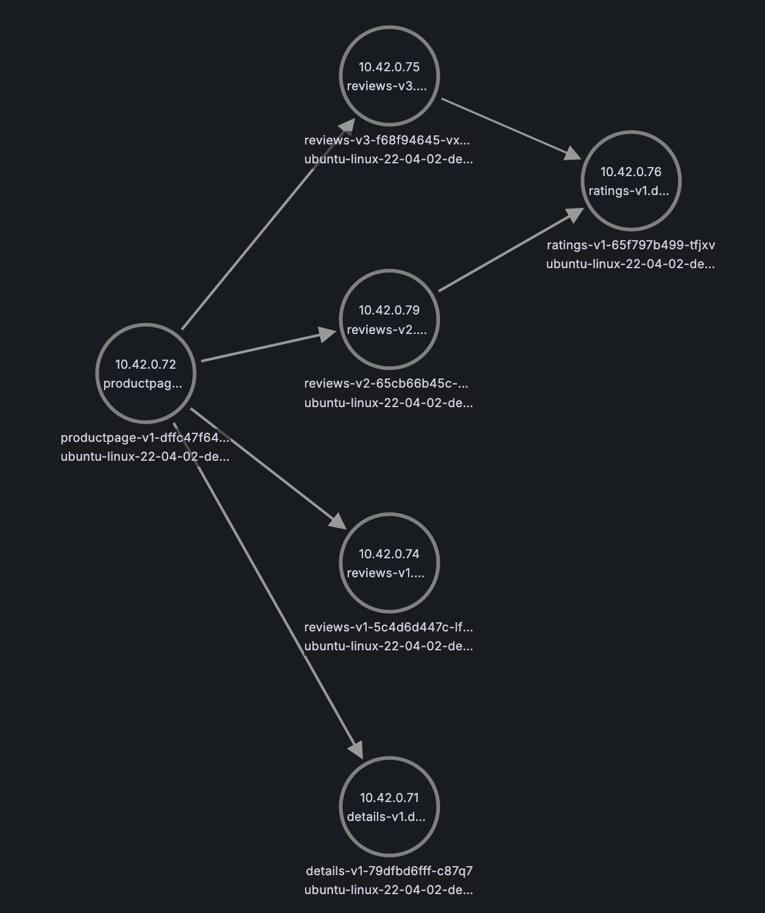

## Ebpf demo for TCP traffic 
This project is a demo that collects TCP traffic by ebpf technical.
Basically, it runs as an opentelemetry collector, which is also a k8s daemonset running on every node. 
First, it attaches itself on a network interface to sniff all network traffic through that nic, and then it packages the traffic as otel trace along with k8s tags, at last, it saves the traces into postgresql database, so that the data could be fetched for any further purposes.

### Architecture
```
                                      +--------------------+      +--------------------+             
                                      |                    |      |                    |             
                                      |  k8s control panel |      |     pg database    |             
                                      |                    |      |                    |             
                                      +----------+---------+      +--------------------+             
                                                 |                          ^                        
+------------------------------------------------+--------------------------+-----------------------+
|                                                |                          |                       |
|       +----------------------------------------+--------------------------+---------------+       |
|       |User Space DaemonSet                    |                          |               |       |
|       |                                        |                          |               |       |
|       |                                        v                          |               |       |
|       |  +------------------+       +--------------------+      +---------+----------+    |       |
|       |  |                  |       |                    |      |                    |    |       |
|       |  |      ebpf        |       |    k8s attribute   |      |     postgresql     |    |       |
|       |  |     Receiver     +------>|      processor     +----->|      exporter      |    |       |
|       |  |                  |       |                    |      |                    |    |       |
|       |  +------------------+       +--------------------+      +--------------------+    |       |
|       |                   ^                                                               |       |
|       |                   |                                                               |       |
|       +-------------------+------------------------------+--------------------------------+       |
|       |  +--------------+ |                              |               L4               |       |
|       |  | ebpf program +-+                              +--------------------------------+       |
|       |  +------+-------+                                |               L3               |       |
|       |         |       +-----------------+              +--------------------------------+       |
|       |  attach +------>|   Raw Socket    |------------->|               L2               |       |
|       |                 |     On L2       |              +--------------------------------+       |
|       |                 +-----------------+              |               NIC              |       |
|       |Kernel Space                                      |                                |       |
|       +--------------------------------------------------+--------------------------------+       |
|                                                                                                   |
+---------------------------------------------------------------------------------------------------+
                                             K8s Node                                                
```

### Usage
1. Preconditions:
   - Linux kernel version > 5.x
   - Golang version > 1.20
2. Build:
   - `make build`
   - `make build-image` (Change `DOCKER_REGISTRY` in the makefile to your own registry)
3. Configure:
   Open the `config.yaml`, and set the following two items,
   - `nic_name`: which nic should be sniffed
   - `dsn`: the postgresql connection link
4. Deploy
   - `make deploy`

### Example
We provided an example to verify the capability of this demo. To set up the example environment, please run `make setup-example`.
The example consists of multiple parts:
- Bookinfo: a fake business project, which is directly reference from the [istio example project](https://istio.io/latest/docs/examples/bookinfo/).
- Grafana: to easily show the traffic, we make use of the Node Graph of Grafana depict the traffic net, so that we could not only show the bookinfo deployment topology, but also show the k8s inner traffic, even the ebpf daemon itself.
- Postgresql: a pg database in case there is no such db in your cluster
- Ingress: the ingress rule to expose the bookinfo out of k8s cluster

In my local env, I use k3s as my own cluster, it by default uses the flannel as the CNI component, so in this kind of env, the network topology is like this:
```
             +-----+          +-----+           +-----+      
             | pod |          | pod |           | pod |      
             +--+--+          +--+--+           +--+--+      
                |                |                 |         
          +-----v-----+    +-----v-----+     +-----v-----+   
pod ns    |   eth0    |    |   eth0    |     |   eth0    |   
----------+-----------+----+-----------+-----+-----------+---
host ns   |  vethxxx  |    |  vethxxx  |     |  vethxxx  |   
          +-----+-----+    +-----+-----+     +-----+-----+   
                |                |                 |         
                |                |                 |         
                |          +-----v------+          |         
                +----------> bridge cni0<----------+         
                           +----^-+-----+                    
                                | |                          
                           +----+-v-----+                    
                           | flannel.1  |                    
                           +----^-+-----+                    
                                | |                          
                           +----+-v-----+                    
                           |  host nic  |                    
                           +------------+                     
```
Therefore, all network traffic (pods in a same node or in different nodes) will go through the bridge `cni0`, the simplest way to use the ebpf-demo is bind it on `cni0` so that it is capable of sniffing all TCP traffic across all Pods.
In the current example, according to the Bookinfo page, the deployment of the Bookinfo is like this:


And after setting up the example env, and operating a couple of times to access the Bookinfo, we could found the following node graph in the Grafana:



### Implementation Details
TBD